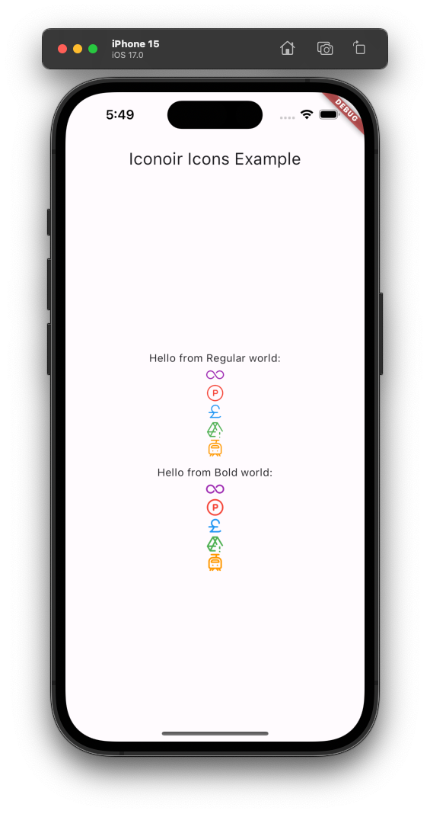

# Flutter Iconoir TTF

## Intro:
The free open source Iconoir icons for Flutter without dependency on flutter_svg like the regular Iconoir package has.

You can just use the Icon widget and be on your way. ✨

There are well over a thousand nice icons to choose from!

It works as a regular TTF font file that can be generated with a script from the original SVGs and also generate the Dart code.

## Usage:

**Add the following to your imports**:

`import 'package:flutter_iconoir_ttf/flutter_iconoir_ttf.dart';`

...then you can use an `Icon` widget where the expected IconData is coming from the `IconoirIcons` or `IconoirIconsBold` class.

**Examples**:

`Icon(IconoirIcons.bluetooth, color: Color(0xFF0000FF))`

`Icon(IconoirIconsBold.bluetooth, color: Color(0xFF0000FF))`

## Package Customization

See the customization document in the git repo:
[customization.md](https://github.com/aakhil-kassim/flutter_iconoir_ttf/docs/customization.md)

## Example Picture

